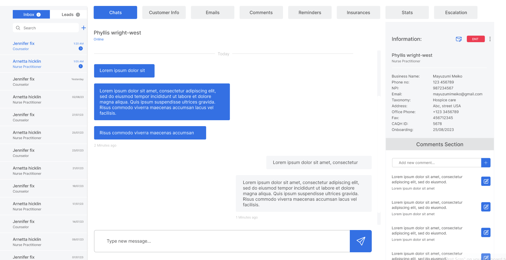
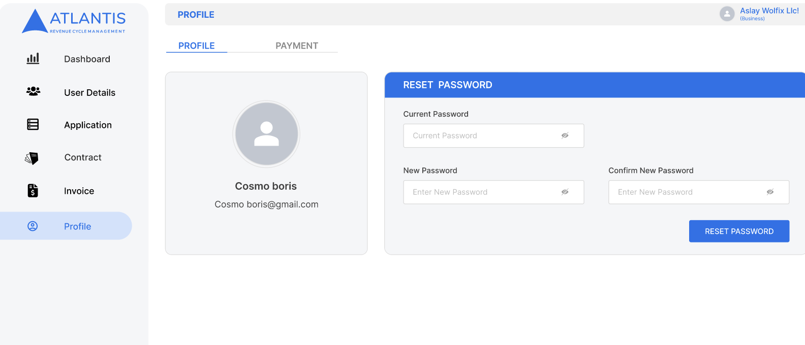

# 🏥 Atlantis RCM — Healthcare Revenue Cycle Management Platform

> Enterprise RCM platform automating the end-to-end medical claims pipeline — patient intake, insurance verification, claim submission, payment reconciliation, and revenue analytics — for medical providers and billing companies.

 🔗 **Marketing site:** https://www.atlantisrcm.com/
  🔒 **Application:** Private / internal use only (medical providers + billing teams)
  👤 **Customer Portal:** https://customer.atlantisrcm.com/login
  🏢 **Built at:** Atlantis BPO Solutions
  📅 **Period:** 2023 — 2025
  📂 **Status:** Production · Active

---

## 🎯 What it does

Atlantis RCM is a Revenue Cycle Management platform that automates the end-to-end medical claims pipeline. It replaces manual, Excel-based billing workflows with a unified system that handles:

- Patient intake and insurance eligibility verification
- Electronic claim submission to payers
- Payment posting via Electronic Remittance Advice (ERA)
- Denial management and appeals
- Real-time revenue analytics and customizable reporting

The platform serves clinics, hospitals, and third-party medical billing companies that need to scale claim volume without proportional headcount growth.

---

## 🛠️ Tech Stack

| Layer | Technology |
|-------|------------|
| **Backend** | Laravel · PHP 8 |
| **Frontend** | React.js · TypeScript · Tailwind CSS |
| **Database** | MySQL · Redis (caching) |
| **Queues / Jobs** | Laravel Horizon · Redis |
| **Auth** | Multi-tenant · RBAC · session-based |
| **API** | REST · webhooks |
| **Infra** | AWS (EC2, RDS, S3, CloudFront) · Docker · GitHub Actions CI/CD |
| **Monitoring** | Sentry · CloudWatch |

---

## ✨ Key Features

- 📋 **Patient intake** — registration + insurance eligibility verification
- 🧾 **Claim submission engine** — electronic + paper claim workflows
- 💰 **Payment posting** — automated ERA parsing and reconciliation
- 📊 **Revenue analytics** — customizable reports by payer, provider, date
- 🚨 **Denial management** — track, categorize, and appeal denied claims
- 🔐 **Role-based access** — provider, biller, admin, supervisor roles
- 🏢 **Multi-tenant architecture** — multiple practices on a single instance
- 🔁 **Real-time alerts** — claim status changes, payment confirmations
- 👥 **Customer portal** — clients view their claims, payments, and reports

---

## 👨‍💻 My Role

As a Senior Full Stack Engineer on this product, I:

- Designed the **multi-tenant architecture** supporting multiple medical practices on a single Laravel instance with isolated data
- Built the **claims-submission engine** handling high-volume daily claim throughput
- Implemented **payment-reconciliation logic** with automated ERA parsing
- Designed **role-based access control (RBAC)** for distinct user roles (provider, biller, admin, supervisor)
- Optimized database queries and added Redis caching to improve dashboard performance
- Built the **customer portal** as a separate React + TypeScript SPA consuming the Laravel REST API
- Set up **CI/CD pipeline** with automated tests and zero-downtime deploys via GitHub Actions
- Integrated payment gateways and external payer APIs (insurance verification, claim submission)

---

## 📸 Screenshots

> Screenshots showcase the public-facing portal. Internal admin views are protected for client privacy.


*Landing page — atlantisrcm.com*


*Customer portal login — clients access their claims and payments*


*RCM dashboard — claim status, revenue overview, alerts*

---

## 🏗️ Architecture

```mermaid
graph LR
    Client[React SPA<br/>Customer Portal] --> API[Laravel REST API]
    AdminUI[Admin Web App] --> API
    API --> DB[(MySQL<br/>Multi-tenant)]
    API --> Cache[(Redis Cache)]
    API --> Queue[Job Queue<br/>Horizon]
    Queue --> Worker[Background Workers]
    Worker --> Payer[Payer / EDI APIs]
    Worker --> S3[(AWS S3<br/>Document Storage)]
    API --> Sentry[Sentry / CloudWatch]
